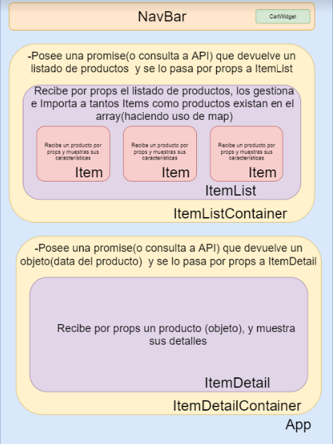

# Proyecto E-commece basado en REACT JS/STYLED-COMPONENTS

_Bienvenidos al E-commerce de DieteticaResponsive_.

## Comienzo 🚀

El proyecto fue creado con [Create React App](https://github.com/facebook/create-react-app).

Si queres usar este proyecto, podes clonar el repositorio desde la consola:

```
git clone https://github.com/cesarb03/EcommerceReactDietetica_Bergamasco
```

Esta pagina esta hecha con _React JS_, por lo que se debe correr con *npm* desde la consola.

```
npm start
```
Y se visualiza en el navegador abriendo [http://localhost:3000](http://localhost:3000).


## Realizacion ⚙️

_Esta tienda es un trabajo realizado para el curso de CoderHouse, de React Js_


## Construido con 🛠️


* [React JS](https://es.reactjs.org/) - El framework usado.
* [Styled-Components](https://styled-components.com/) - Estilos.
* [React Router Dom](https://reactrouter.com/) - Usado para generar rutas de enlaces.
* [Firebase](https://firebase.google.com/) - Utilizado para guardar la base de datos de cada uno de los productos que se encuentran a la "venta" en el proyecto.

## Recursos del proyecto
* ```RouterDom``` Para el routing (en conjunto con useParams para acceder a los parametros de las rutas).
* ```useEffect``` Para controlar las actualizaciones de los renderizados.
* ```useState``` Para utilizar variables de estado.
* ```Context``` Como recurso de lectura y escritura para la información relacionada al Cart.
* ```Sweetalert y React-icons``` Responsable de llevar a cabo los pop-ups y la inserción de diferentes iconos respectivamente, para proporcionar animación al proyecto.


## Component's structure



## Autores ✒️

* **César Bergamasco** - *Trabajo Inicial* - [Github](https://github.com/cesarb03)

#### Cooperación

* **Alejandro Fernandez** - *Profesor CoderHouse* 
* **Ramiro D' Accorso** - *Tutor CoderHouse* 

#### Sitio Web

[](https://app.netlify.com/sites/react31130dietetica/deploys) [Ir al sitio](https://react31130dietetica.netlify.app/)
 
